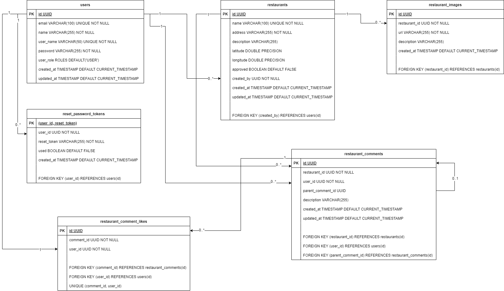

This is a [Next.js](https://nextjs.org/) project bootstrapped with [`create-next-app`](https://github.com/vercel/next.js/tree/canary/packages/create-next-app).

## Getting Started 💻

_you must have `docker` installed_

Step 1:

- With docker running on your machine, run the development server:

> it will compose the docker file and run development server

```bash
pnpm dev
```

### Step 2:

- Open you browser in http://localhost:3000

## Database Modeling 📅


