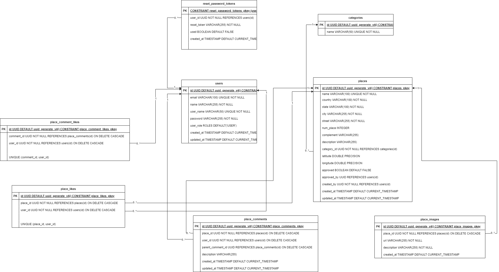

# About "Onde ir"

Onde ir is a comprehensive food advisory platform designed to help users discover and share experiences about various food establishments, similar to TripAdvisor but with a focus on specific categories such as restaurants (more categories will be added in the future).

This Next.js fullstack project leverages modern web technologies and libraries to create a robust and user-friendly application. Here's a detailed breakdown of the project's key features and technologies:

Project Framework: The project is built using Next.js, a powerful React framework that enables server-side rendering and static site generation, providing an optimized performance and improved SEO.

Component Library: The user interface is enhanced with NextUI (nextui-org/react), a modern and customizable React UI library, ensuring a sleek and responsive design across various devices.

Authentication System: A complete authentication system will be implemented, including user registration, login, and secure password management workflows such as password reset and forgot password. This ensures a secure and user-friendly authentication experience.

Email Integration: The project will integrate with an email provider using Resend, facilitating email notifications and verifications for various user actions like account activation and password reset.

Photo Upload: Users will be able to upload photos of food establishments, enhancing the overall user experience. This feature will be integrated with Cloudinary, a powerful cloud-based image and video management service, ensuring efficient and optimized media handling.

## Features in Development 🔋

- **Authentication System**: The full authentication system is currently being developed and will include features like password reset and forgot password workflows.
- **Email Provider Integration**: Integration with Resend for email notifications and verifications is planned.
- **Photo Upload Integration**: Integration with Cloudinary for seamless photo uploads and management is underway.

## Status 🚧

- Work in progress

## Getting Started 💻

_you must have `docker` installed_

Step 1:

- With docker running on your machine, run the development server:

> it will compose the docker file and run development server

```bash
pnpm dev
```

### Step 2:

- Open you browser in http://localhost:3000

## Database Modeling 🐳


